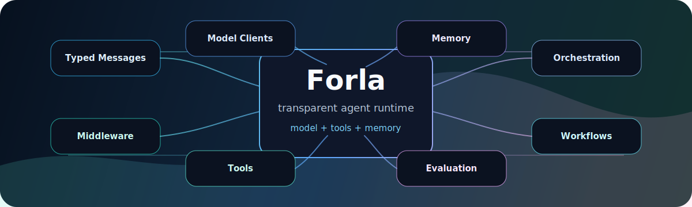

<div align="center">
  

  <h1>Forla</h1>

  <p>
    <strong>A clean, async-first framework for building transparent AI agents, multi-agent systems, and deterministic workflows in Python.</strong>
  </p>

  <p>
    <a href="#quick-start">Quick Start</a>
    |
    <a href="#autonomous-coding-agent">Coding Agent</a>
    |
    <a href="#architecture">Architecture</a>
    |
    <a href="#comparison">Comparison</a>
  </p>

  <p>
    
    
    
    
  </p>
</div>

---

Forla is built around a simple idea: agent systems become easier to trust when the runtime is visible.

Instead of hiding everything behind a giant abstraction, Forla gives you the core pieces directly: typed messages, model clients, tools, memory, middleware, orchestration, termination conditions, workflows, evaluation, and a web UI surface. The result is a framework that is small enough to understand and complete enough to demonstrate serious multi-agent engineering patterns.

```text
Agent = model reasoning + tool execution + memory
```

**Built for:** learning, technical interviews, agent runtime experiments, portfolio projects, internal prototypes, and engineers who want to understand what is happening inside the loop.

## What Makes It Feel Different

| Capability | What Forla gives you |
|---|---|
| Transparent agent loop | `run_stream()` is the primitive; `run()` is just the final-response wrapper. |
| Typed protocol | System, user, assistant, tool, and stop messages are first-class objects. |
| Tool execution | Plain functions and custom tools become LLM-callable JSON-schema tools. |
| Persistent memory | Agents can read and write sandboxed markdown memory across sessions. |
| Middleware | Intercept model calls and tool calls for logging, safety, policy, and observability. |
| Multi-agent orchestration | Coordinate specialists with round-robin or AI-driven routing patterns. |
| Deterministic workflows | Use graph-style `FunctionStep` workflows when agents are the wrong tool. |
| Evaluation | Run task suites and use an LLM judge for natural-language outputs. |

## Install

```bash
python -m venv .venv
.venv\Scripts\activate
pip install -e ".[dev]"
```

macOS or Linux:

```bash
python -m venv .venv
source .venv/bin/activate
pip install -e ".[dev]"
```

For OpenAI-backed examples:

```bash
set OPENAI_API_KEY=your_api_key_here
```

macOS or Linux:

```bash
export OPENAI_API_KEY=your_api_key_here
```

## Quick Start

```python
import asyncio
import os

from forla import Agent, OpenAIChatCompletionClient
from forla.tools import ThinkTool


async def main():
    model = OpenAIChatCompletionClient(
        model="gpt-4.1-mini",
        api_key=os.getenv("OPENAI_API_KEY"),
    )

    agent = Agent(
        name="assistant",
        description="A concise technical assistant",
        instructions="Answer clearly. Use tools when useful.",
        model_client=model,
        tools=[ThinkTool()],
    )

    response = await agent.run("Explain async AI agents in one paragraph.")
    print(response.content)
    print(response.usage)


if __name__ == "__main__":
    asyncio.run(main())
```

## Autonomous Coding Agent

The flagship example is a software-engineering multi-agent team inspired by the patterns behind tools like GitHub Copilot, Cursor, and Claude Code:

```bash
python examples/05_autonomous_coding_agent.py
```

Or run it against a disposable workspace:

```bash
python examples/05_autonomous_coding_agent.py ^
  --workspace .\scratch\agent-workspace ^
  "Add validation, update tests, run verification, and summarize the diff."
```

It demonstrates:

| Pattern | Implementation |
|---|---|
| Agent + tools + memory | `Agent`, `WorkspaceTool`, `CommandTool`, `MemoryTool` |
| Metacognition | `ThinkTool` forces explicit planning before action. |
| Surgical edits | `workspace.str_replace` rejects ambiguous edits. |
| Persistent task state | `/memories/current_task.md` uses markdown checkboxes. |
| Verification loop | `run_command` allows tests, compile checks, lint, and diff inspection. |
| Explicit completion | `TaskStatusTool` prevents premature termination. |
| Multi-agent review | Architect, implementer, and reviewer collaborate until `SHIP_READY`. |

The workflow encoded in the prompt is intentionally concrete:

```text
Memory check -> Planning -> Execution -> Learning -> Completion
```

## Architecture

```text
User task
   |
   v
Agent.run_stream()
   |
   +-- prepare context
   |     +-- system instructions
   |     +-- application memory
   |     +-- conversation history
   |
   +-- call model through middleware
   |
   +-- if the model requests tools
   |     +-- execute tools through middleware
   |     +-- append ToolMessage results
   |     +-- continue the loop
   |
   +-- if the model returns text
         +-- update memory
         +-- emit AgentResponse
```

## Framework Surface

| Layer | Purpose | Key classes |
|---|---|---|
| Messages | Shared communication protocol | `UserMessage`, `AssistantMessage`, `ToolMessage`, `StopMessage` |
| Models | Provider abstraction | `BaseChatCompletionClient`, `OpenAIChatCompletionClient` |
| Agents | Reasoning loop | `Agent`, `BaseAgent`, `AgentResponse` |
| Tools | Structured actions | `BaseTool`, `FunctionTool`, `ThinkTool`, `TaskStatusTool`, `MemoryTool` |
| Memory | Context and persistent knowledge | `AgentContext`, `BaseMemory`, `ListMemory` |
| Middleware | Runtime interception | `BaseMiddleware`, `LoggingMiddleware`, `SecurityMiddleware` |
| Orchestration | Multi-agent coordination | `RoundRobinOrchestrator`, `AIOrchestrator` |
| Termination | Safe stopping | `MaxMessageTermination`, `TextMentionTermination`, `TokenBudgetTermination` |
| Workflows | Deterministic execution | `Workflow`, `FunctionStep`, `WorkflowRunner` |
| Evaluation | Quality measurement | `EvaluationRunner`, `LLMJudge` |

## Examples

| Example | Focus |
|---|---|
| `examples/01_basic_agent.py` | Single-agent model call |
| `examples/02_poet_critic.py` | Multi-agent collaboration |
| `examples/03_web_app.py` | FastAPI web app integration |
| `examples/04_full_system.py` | Workflow, orchestration, memory, and middleware |
| `examples/05_autonomous_coding_agent.py` | Autonomous software-engineering agent team |

## Comparison

Forla is not positioned as a massive production platform. It is the readable, inspectable agent framework you can study, modify, and explain end to end.

| Project | Primary orientation | Strong fit | Forla difference |
|---|---|---|---|
| **Forla** | Transparent agent runtime | Learning, portfolios, prototypes, custom runtimes | Small codebase, explicit loop, easy to inspect. |
| [LangGraph](https://www.langchain.com/langgraph) | Stateful graph runtime | Durable graph-based agent apps | Forla starts with simpler primitives before graph runtime complexity. |
| [Microsoft AutoGen / Agent Framework](https://learn.microsoft.com/agent-framework/overview/agent-framework-overview) | Enterprise multi-agent workflows | Microsoft ecosystem and production agent workflows | Forla is smaller and easier to reason about line by line. |
| [CrewAI](https://docs.crewai.com/en/index) | Crews, flows, role-based automation | Fast team-style agent setup | Forla exposes the lower-level building blocks behind those patterns. |
| Direct model SDK | Raw LLM calls | Simple generation or basic tool calling | Forla adds memory, middleware, orchestration, termination, workflows, and eval. |

## Project Layout

```text
src/forla/
  agents/          Agent loop and base abstractions
  llm/             Model client interfaces and OpenAI-compatible client
  tools/           Tool interfaces, function tools, memory, status, thinking
  memory/          Application-managed memory
  middleware/      Request/response interceptors
  orchestration/   Multi-agent coordination
  termination/     Stop conditions
  workflow/        Deterministic workflow graph engine
  eval/            Evaluation runner and judges
  webui/           FastAPI/SSE web UI
examples/          Runnable demos
tests/             Unit and integration tests
```

## Quality Bar

Run tests:

```bash
pytest tests -q
```

Compile-check the package and examples:

```bash
python -m compileall -q src tests examples
```

Current local verification:

```text
12 passed, 7 skipped
```

The skipped tests require `OPENAI_API_KEY`.

## Security Model

Agent tools are powerful, so Forla examples show boundaries:

- Tools return structured `ToolResult` objects instead of crashing the loop.
- `MemoryTool` validates paths to prevent directory traversal.
- The coding-agent workspace tool keeps edits inside a configured sandbox.
- The command tool uses an allowlist and rejects shell metacharacters.
- `SecurityMiddleware` can block suspicious model-call inputs before they reach the LLM.

## Roadmap

- Pydantic v2 `ConfigDict` cleanup.
- More model providers.
- Human approval middleware.
- Richer streaming UI.
- Persistent workflow checkpoints.
- MCP tool integration.
- First-class tracing and OpenTelemetry examples.

## Contributing

Good contributions are focused, typed, and testable.

Please include:

- A clear problem statement.
- A small implementation.
- Tests or an example.
- No unrelated rewrites.

## License

Add a `LICENSE` file before publishing or distributing this project.
